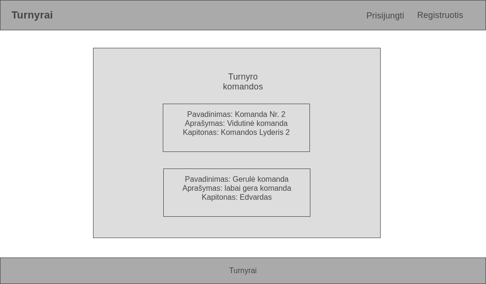

# Sprendžiamo uždavinio aprašymas
## Sistemos paskirtis
Projekto tikslas – Sukurti informacinę sistemą, kuri padėtų kurti įvariausius turnyrus ir juos valdyti.

Veikimo principas – informacinę sistemą sudarys naudotojo sąsaja, kuri bus pasiekiama per internetinę aplikaciją, ir kuria naudosis visi sistemos naudotojai bei aplikacijų programavimo sąsaja (angl. trump. *API*).

Sistemos administratorius galės sukurti ir administruoti turnyrą į kurį komandų atstovai galės registruoti savo atstovaujamas komandas. Komanda yra įregistruojama jos atstovo ir sudaroma iš tam tikro žaidėjų kiekio, kuriuos į ją registruoja jos atsotvas. Komandos atstovas gali administruoti savo komandą redaguodamas žaidėjų duomenis, pridėdamas naujus žaidėjus ar pašalindamas esamus. Administratorius turės visus įmanomus sistemos funkcionalumus. Neužsiregistravęs naudotojas ir naudotojas turintis svečio rolę galės peržiūrėti esamus turnyrus, komandas, rungtynių informaciją, tačiau negalės atlikti pakeitimų sistemoje. 

## Funkciniai reikalavimai
Neregistruotas informacinės sistemos naudotojas galės:
1.	Peržiūrėti prisijungimo puslapį;
2.	Užsiregistruoti į sistemą;
3.	Peržiūrėti turnyrus, komandas, žaidimus, žaidėjus;

Registruotas informacinės sistemos naudotojas galės:
1.	Prisijungti prie sistemos;
2.	Peržiūrėti turnyrus, komandas, žaidimus, žaidėjus;
3.	Atsijungti nuo sistemos;

Komandos atstovas galės:
1.	Peržiūrėti turnyrus;
2.	Įregistruoti savo komandą į turnyrą;
3.	Pridėti, pašalinti, redaguoti, peržiūrėti savo komandos žaidėjus;
4.	Peržiūrėti kitus žaidėjus;
5.	Peržiūrėti kitas komandas;

Administratorius galės:
1.	Sukurti, ištrinti, redaguoti, peržiūrėti turnyrą;
2.	Sukurti, ištrinti, redaguoti, peržiūrėti komandą;
3.	Sukurti, ištrinti, redaguoti, peržiūrėti žaidėjus;

# Sistemos architektūra

Sistemos sudedamosios dalys:

+ Kliento pusė (angl. *Front-end*) – bus realizuojama naudojant *React* karkasą. Nuoroda į repozitoriją: https://github.com/edvardas23/saitynai/tree/master/turnyrai-frontend.

+ Serverio pusė (angl. *Back-end*) – bus realizuojama naudojant C#. Duomenų bazė MSSQL. Nuoroda į repozitoriją: https://github.com/edvardas23/saitynai/tree/master/Turnyrai%20API.

Paveikslėlyje pavaizduota kuriamos informacinės sistemos diegimo diagrama. Sistemos talpinimui bus naudojamas serveris. Kiekviena sistemos dalis yra diegiama tame pačiame serveryje. Internetinė aplikacija yra pasiekiama per HTTP protokolą. Šios sistemos sistemos veikimui yra reikalingas sistemos API, kuris būtų pasiekiamas per aplikacijų programavimo sąsają ir padėtų atlikti įvarias operacijas su duomenų baze.

# Naudotojo sąsajos projektas
## Pagrindinis puslapis - Turnyrų sąrašas
| Wireframe |
| --- |
|  |

| Realizacija |
| --- |
|  |

## Komandų sąrašas
| Wireframe |
| --- |
|  |

| Realizacija |
| --- |
|  |

## Žaidėjų sąrašas
| Wireframe |
| --- |
|  |

| Realizacija |
| --- |
|  |

## Prisijungimas
| Wireframe |
| --- |
|  |

| Realizacija |
| --- |
|  |

## Registracija
| Wireframe |
| --- |
|  |

| Realizacija |
| --- |
|  |

## Turnyro pridėjimo/redagavimo/pašalinimo langai
Kitų sistemos objektų pridėjimo, redagavimo ir pašalinimo operacijos taip pat realizuotos naudojant modalinius langus.

| Pridėti turnyrą |
| --- |
|  |

| Redaguoti turnyrą |
| --- |
|  |

| Pašalinti turnyrą |
| --- |
|  |

# API specifikacija

<table>
  <tr><td>Atsakymo formatas</td><td>JSON</td></tr>
  <tr><td>Norma ribota?</td><td>Neribota</td></tr>
</table>

## Turnyrų API metodai

### Gauti visus turnyrus

<table>
  <tr><td>API metodas </td><td>Get All Tournaments (GET)</td></tr>
  <tr><td>Paskirtis</td><td>Gauti visus turnyrus ir jų informaciją</td></tr>
  <tr><td>Kelias iki metodo (angl. route)</td><td>/api/tournaments</td></tr>
  <tr><td>Užklausos struktūra</td><td>-</td></tr>
  <tr><td>Užklausos „header“ dalis</td><td>-</td></tr>
  <tr><td>Atsakymo struktūra</td><td>{
        "id": 1,
        "name": "Geras turnyras",
        "description": "Labai puikus turnyras",
        "prize": 10000
    },
    {
        "id": 2,
        "name": "Turnyras Nr.2",
        "description": "Vidutinis Turnyras",
        "prize": 5000
    }</td></tr>
   <tr><td>Atsakymo kodas</td><td>200 - OK</td></tr>
   <tr><td>Galimi atsakymo kodai</td><td>404 - Not Found, įvedus neteisingą kelią</td></tr>
</table>

### Gauti vieną turnyrą

<table>
  <tr><td>API metodas </td><td>Get Tournament (GET)</td></tr>
  <tr><td>Paskirtis</td><td>Gauti turnyrą ir jo informaciją</td></tr>
  <tr><td>Kelias iki metodo (angl. route)</td><td>/api/tournaments/{tournamentId}</td></tr>
  <tr><td>Užklausos struktūra</td><td>-</td></tr>
  <tr><td>Užklausos „header“ dalis</td><td>-</td></tr>
  <tr><td>Atsakymo struktūra</td><td>{
    "id": 1,
    "name": "Geras turnyras",
    "description": "Labai puikus turnyras",
    "prize": 10000
  }</td></tr>
   <tr><td>Atsakymo kodas</td><td>200 - OK</td></tr>
   <tr><td>Galimi atsakymo kodai</td><td>404 - Not Found, įvedus neteisingą kelią. </td></tr>
</table>

### Sukurti turnyrą

<table>
  <tr><td>API metodas </td><td>Create Tournament (POST)</td></tr>
  <tr><td>Paskirtis</td><td>Sukurti naują turnyrą</td></tr>
  <tr><td>Kelias iki metodo (angl. route)</td><td>/api/tournaments/</td></tr>
  <tr><td>Užklausos struktūra</td><td>{
    "name": "Turnyras Nr.6",
    "description": "Prastas Turnyras",
    "prize": 1000
}</td></tr>
  <tr><td>Užklausos „header“ dalis</td><td>Authorization: Bearer {token}</td></tr>
  <tr><td>Atsakymo struktūra</td><td>{
    "id": 1,
    "name": "Geras turnyras",
    "description": "Labai puikus turnyras",
    "prize": 10000
  }</td></tr>
   <tr><td>Atsakymo kodas</td><td>201 - Created</td></tr>
   <tr><td>Galimi atsakymo kodai</td><td>404 - Not Found, įvedus neteisingą kelią. 401 - Unauthorized, netinkamas arba neegzistuojantis token. 400 - Bad request, neįvesta privaloma užklausos informacija </td></tr>
</table>

### Redaguoti turnyrą

<table>
  <tr><td>API metodas </td><td>Update Tournament (PUT)</td></tr>
  <tr><td>Paskirtis</td><td>Redaguoti turnyro informaciją</td></tr>
  <tr><td>Kelias iki metodo (angl. route)</td><td>/api/tournaments/{tournamentId}</td></tr>
  <tr><td>Užklausos struktūra</td><td>{
    "name": "Turnyras Nr. 4",
    "description": "Blogas Turnyras",
    "prize": 1000
}</td></tr>
  <tr><td>Užklausos „header“ dalis</td><td>Authorization: Bearer {token}</td></tr>
  <tr><td>Atsakymo struktūra</td><td>{
    "id": 1,
    "name": "Turnyras Nr. 4",
    "description": "Blogas Turnyras",
    "prize": 1000
}</td></tr>
   <tr><td>Atsakymo kodas</td><td>200 - OK</td></tr>
   <tr><td>Galimi atsakymo kodai</td><td>404 - Not Found, įvedus neteisingą kelią. 401 - Unauthorized, netinkamas arba neegzistuojantis token. 400 - Bad request, neįvesta privaloma užklausos informacija </td></tr>
</table>

### Pašalinti turnyrą

<table>
  <tr><td>API metodas </td><td>Delete Tournament (DELETE)</td></tr>
  <tr><td>Paskirtis</td><td>Pašalinti turnyrą</td></tr>
  <tr><td>Kelias iki metodo (angl. route)</td><td>/api/tournaments/{tournamentId}</td></tr>
  <tr><td>Užklausos struktūra</td><td>-</td></tr>
  <tr><td>Užklausos „header“ dalis</td><td>Authorization: Bearer {token}</td></tr>
  <tr><td>Atsakymo struktūra</td><td>-</td></tr>
   <tr><td>Atsakymo kodas</td><td>204 - No Content</td></tr>
   <tr><td>Galimi atsakymo kodai</td><td>404 - Not Found, įvedus neteisingą kelią. 401 - Unauthorized, netinkamas arba neegzistuojantis token. </td></tr>
</table>

